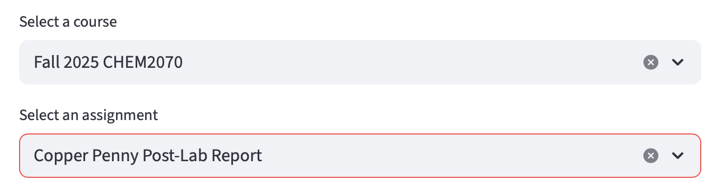
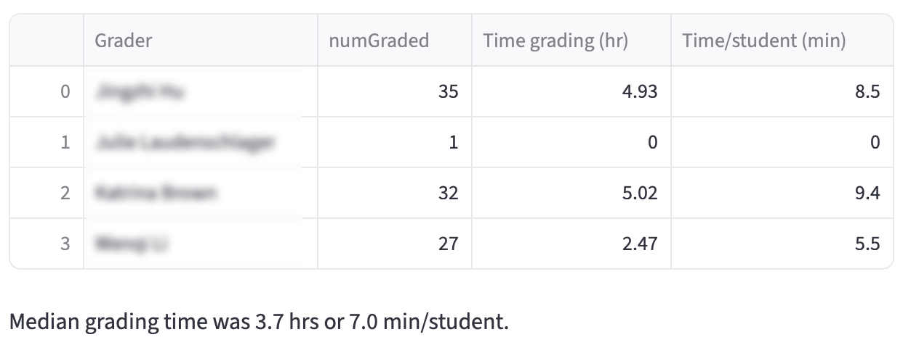
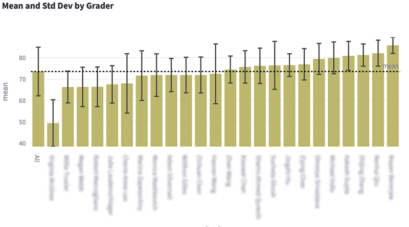

# Gradescope Microscope
## A Streamlit package for the analysis of grading in Gradescope 

    

This package downloads the entire grading history of a Gradescope assignment and then provides tools
for its analysis on either a course-wide or grader-by-grader basis.

This package uses Selenium, a framework for automating web browsers.

### Download Gradescope Results

This module allows the user to log in to Gradescope "manually," using either SSO authentication 
or a stored password. The user then selects a course and an assignment in that course using
dropdown menus, as illustrated below.  

    

After the "Start Downloading" button is pushed, the script loops through the assignment
in Gradescope, finding all of the rubric items. The script then loops through each rubric item
and records the grading activity associated with that item. Once complete, the user is given the opportunity
to save the grading data in a csv for analysis with "Analyze Grader Activity."

This module (and the next one) also show all regrade activity, including student requests and grader
replies. These are presented in an easy to scan format as shown below.  

    

There is also an option to download the Evaluations Folder for analysis with "Analyze Grades."  

### Analyze Grader Activity  

This module analyzes the grading activity downloaded by the previous script. Drag the grader activity csv
from your Downloads folder onto the file uploader. An estimate of the
time each grader spent grading is calculated, as shown below.

    

The grading and regrading data are also presented in an easy to read histogram for the entire class
and on a grader-by-grader basis.

    

This module also identifies papers that had multiple graders. This can be useful for catching 
unauthorized grading if each paper is supposed to be graded (and regraded) by a single grader. The script
can also be used to analyze an individual grader's behavior, which can be useful in understanding
slow graders or awkward rubrics.

### Analyze Grades

This module analyzes grading stored in a folder of Gradescope scores for an assignment, producing a grader-by-grader analysis as shown below.  

To perform the analysis, download the Evaluations Folder with "Download Gradescope Results" (or mannualy).
Drag the resulting folder from your Downloads folder onto "Drag and drop files here."
Give the analysis a name in the modal dialog. An analysis of all problems will appear.  

To analyze a single problem, use the dropdown menu in the sidebar to select it.

### Update Gradescope Credentials  

If you use a username and password to log in to Gradescope, you can store them in your system keychain  
using this module. There is no need to do this if you prefer to log in manually.

### Settings  

This module allow certain user settings to be stored in prefs.toml in the .streamlit folder

### Installation
– Use Anaconda and pip install to make an env contains the following packages:  
  
    beautifulsoup4  
    keyring  
    numpy
    openpyxl  
    pandas  
    plotly  
    selenium  
    streamlit  
    tomlkit
    XlsxWriter  
 
– cd to the folder that will contain Gradescope Microscope  
– git clone https://github.com/MAHines/Gradescope-Microscope.git   

### Running Gradescope Microscope from the command line
– cd to Gradescope-Microscope folder  
– streamlit run microscope.py  

### Updating Gradescope-Microscope from the command line
– cd to Gradescope-Microscope folder  
– git pull  

